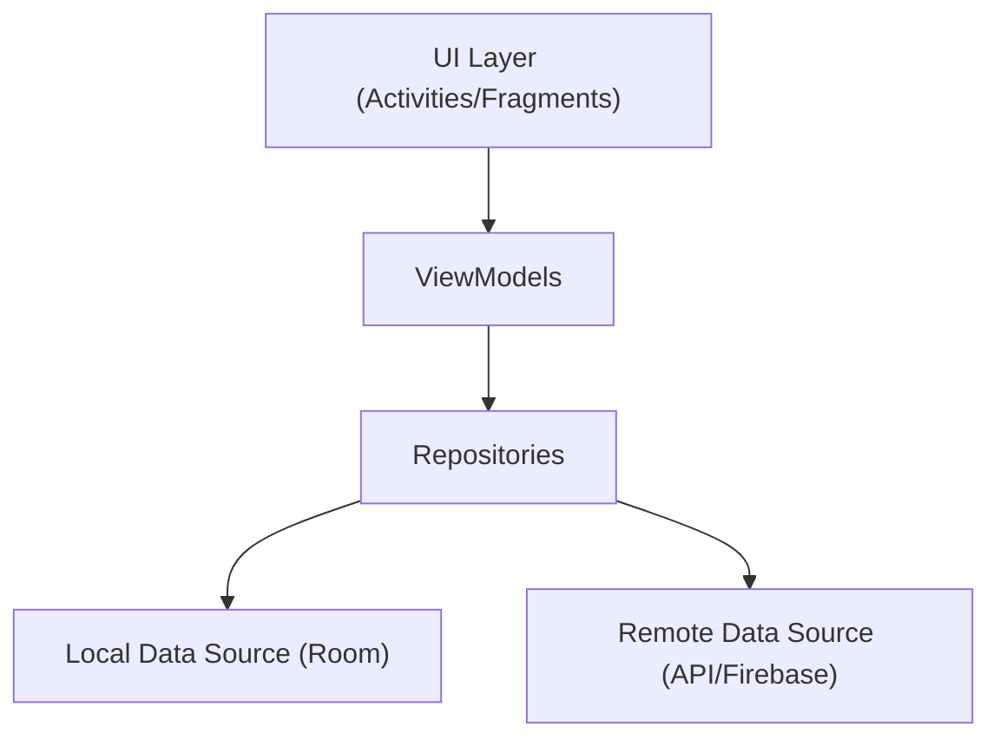

```markdown
# Documentation GFit

## Table des matières
0.[Introduction](#introduction)
1. [Architecture](#architecture)
2. [Composants principaux](#composants-principaux)
3. [Flux de données](#flux-de-données)
4. [Base de données](#base-de-données)
5. [Authentification](#authentification)
6. [Gestion des programmes d'entraînement](#gestion-des-programmes-dentraînement)
7. [Guide d'utilisation](#guide-dutilisation)

## Introduction
gFIT est une application mobile de suivi sportif qui permet aux utilisateurs de suivre générer
un programme sportif adapté à leurs objectifs : perte de poids, prise de masse musculaire, amélioration du cardio
ou coordination. 

## Architecture

GFit suit l'architecture MVVM (Model-View-ViewModel) avec les principes de Clean Architecture :




### Structure des packages


## Composants principaux

### 1. ViewModels

#### UserViewModel

Gère l'authentification et les opérations liées à l'utilisateur.

```kotlin
class UserViewModel(private val repository: UserRepository) {
    fun login(email: String, password: String)
    fun signup(email: String, password: String)
    fun logout()
    fun currentUser()
}
```

#### WorkoutViewModel

Gère la génération et la persistance des programmes d'entraînement.

```kotlin
class WorkoutViewModel(private val repository: WorkoutRepository) {
    val workoutState: StateFlow<WorkoutState>
    fun generateWorkoutPlan(preferences: UserWorkoutPreferences, userId: String)
    fun loadSavedWorkoutProgram(userId: String)
}
```

### 2. Repositories

#### UserRepository

Interface entre la couche données et la couche présentation pour les opérations utilisateur.

```kotlin
class UserRepository(private val userDao: UserDao) {
    fun login(email: String, password: String): Flow<States<FirebaseUser>>
    fun signup(email: String, password: String): Flow<States<FirebaseUser>>
    suspend fun logout()
    fun currentUser(): FirebaseUser?
}
```

#### WorkoutRepository

Gère les opérations liées aux programmes d'entraînement.

```kotlin
class WorkoutRepository(
    private val apiService: WorkoutApiService,
    private val workoutProgramDao: WorkoutProgramDao
) {
    suspend fun fetchWorkoutPlan(preferences: UserWorkoutPreferences)
    suspend fun saveWorkoutProgram(userId: String, exercises: List<WorkoutExercise>)
    suspend fun getLatestWorkoutProgram(userId: String)
    suspend fun deletWorkoutProgram(userId: String)
}
```

## Flux de données


[UploadisequenceDiagram
    participant U as User
    participant A as Activity
    participant VM as ViewModel
    participant R as Repository
    participant API as Remote API
    participant DB as Local DB

    U->>A: Action utilisateur
    A->>VM: Appel méthode
    VM->>R: Requête données
    R->>API: Appel API
    API-->>R: Réponse
    R->>DB: Sauvegarde
    R-->>VM: Données
    VM-->>A: État mis à jour
    A-->>U: UI mise à journg diagram.mermaid…]()

## Base de données

### Schéma de la base de données


[Uploading dierDiagram
    USERS ||--o{ WORKOUT_PROGRAMS : has
    USERS {
        string email PK
        string uid
        long lastLoginTime
    }
    WORKOUT_PROGRAMS {
        long id PK
        string userId FK
        string exercises
        long createdAt
    }agram (1).mermaid…]()

### Entités

#### UserEntity

```Kotlin
@Entity(tableName = "users")
data class UserEntity(
    @PrimaryKey val email: String,
    val uid: String,
    val lastLoginTime: Long
)
```
#### WorkoutProgramEntity

```kotlin
@Entity(tableName = "workout_programs")
data class WorkoutProgramEntity(
    @PrimaryKey(autoGenerate = true) val id: Long,
    val userId: String,
    val exercises: String,
    val preferences: String
    val createdAt: Long
)
```

## Authentification

L'authentification utilise Firebase Auth avec un flux d'états personnalisé :

```kotlin
sealed class States<T> {
    data class Loading<T>(val text: String) : States<T>()
    data class Success<T>(val data: T) : States<T>()
    data class Failed<T>(val message: String) : States<T>()
}
```

### Processus d'authentification

1. L'utilisateur entre ses identifiants
2. FirebaseAuthService traite la demande
3. Le résultat est émis via un Flow d'états
4. En cas de succès, les données utilisateur sont persistées localement


## Gestion des programmes d'entraînement

### Génération de programme

1. Collecte des préférences utilisateur
2. Appel à l'API Gemini via le WorkoutRepository
3. Parsing de la réponse JSON
4. Persistance locale du programme
5. Affichage dans le RecyclerView


### Format des données d'exercice

```json
{
  "title": "Nom de l'exercice",
  "duration": 30,
  "day": "Week 1, Day 1",
  "imageUrl": "https://example.com/image.jpg"
}
```
### Gestion des erreurs

Le système utilise un pattern Result pour gérer les erreurs :

```kotlin
when (state) {
    is WorkoutState.Loading -> showLoading()
    is WorkoutState.Success -> handleSuccess(state.exercises)
    is WorkoutState.Error -> showError(state.message)
}
```
## Guide d'utilisation

### Configuration initiale

### Configuration initiale
1. cloner le projet
    https://github.com/maliklafia-dev/GFIT.git
2.   Rendez vous sur : https://aistudio.google.com/welcome
3.  Créez un compte puis générez votre clé API
4. Créez un fichier local.properties
5. Créez la variable : GOOGLE_GEMINI_API_KEY = votre_cle_api

### Lancer l'application
Lancer l'application avec Run
### Gestion des erreurs

Le système utilise un pattern Result pour gérer les erreurs :

```kotlin
when (state) {
    is WorkoutState.Loading -> showLoading()
    is WorkoutState.Success -> handleSuccess(state.exercises)
    is WorkoutState.Error -> showError(state.message)
}
```

### Designs 


https://github.com/user-attachments/assets/f9c7602c-3e6b-40c9-ae0d-2fe81b0a8942

